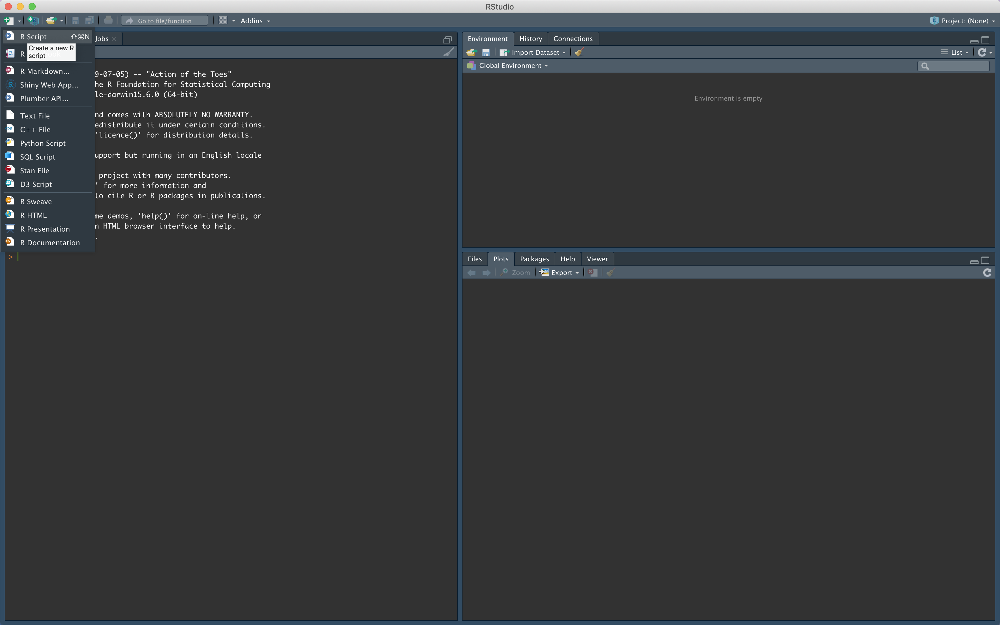
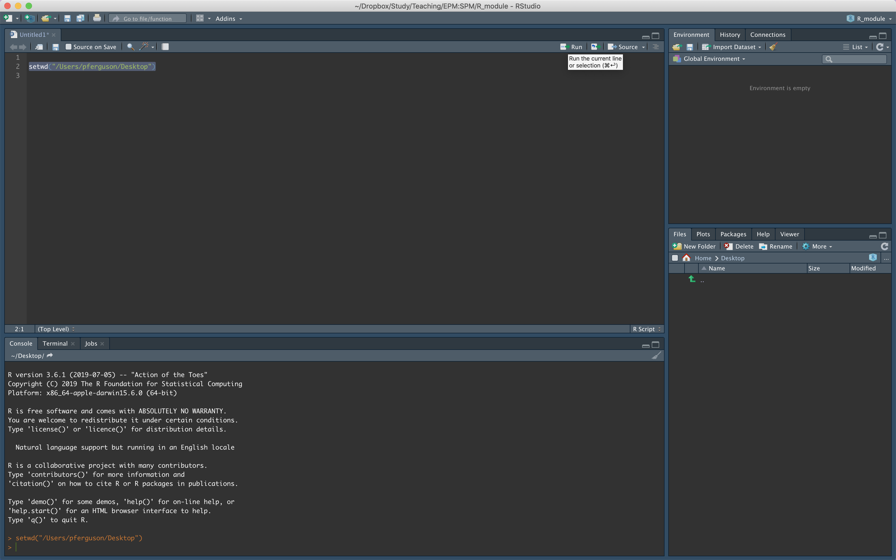
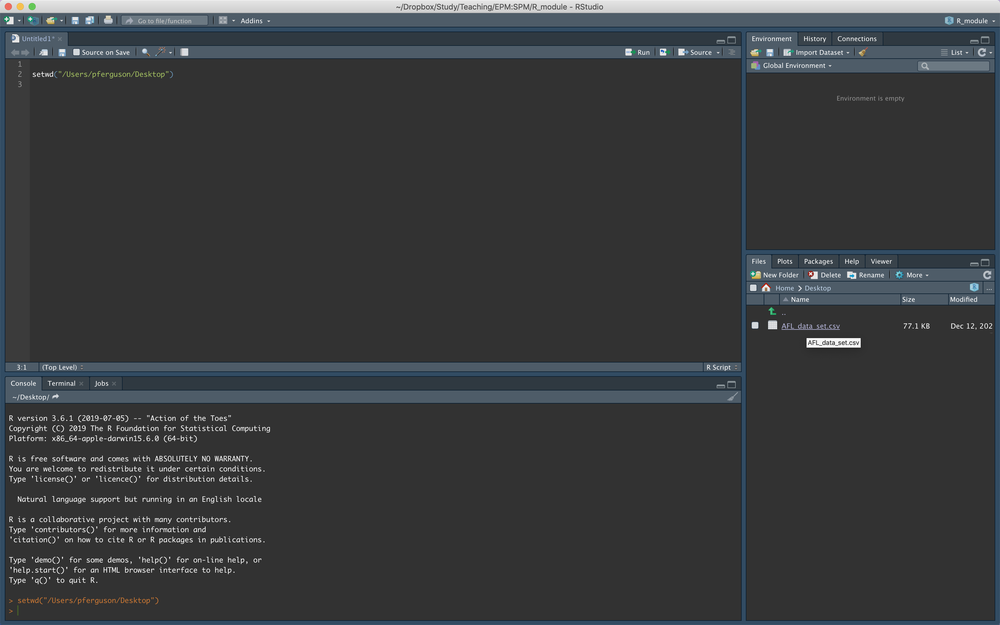
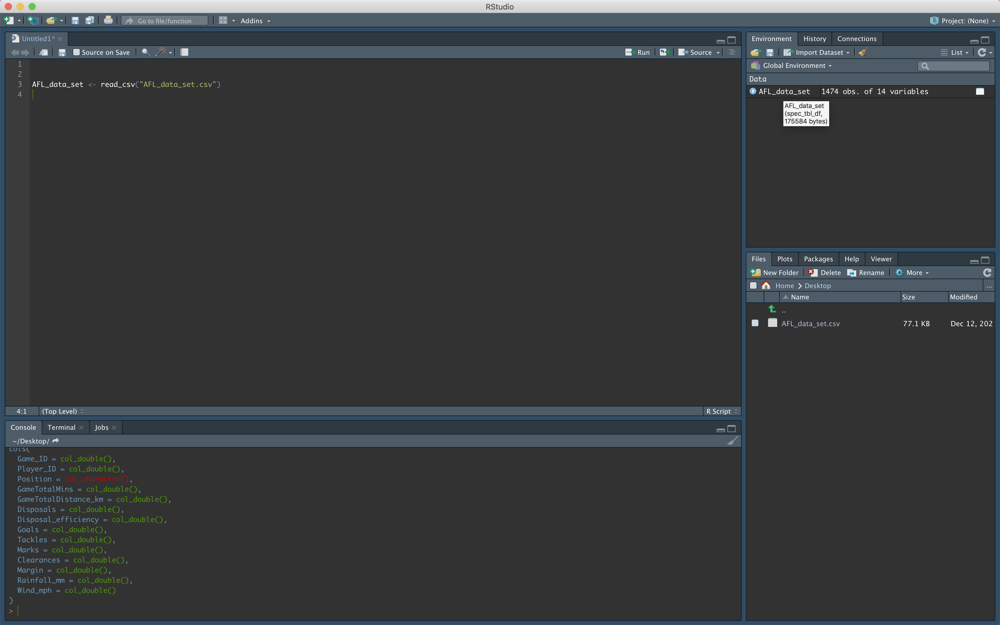
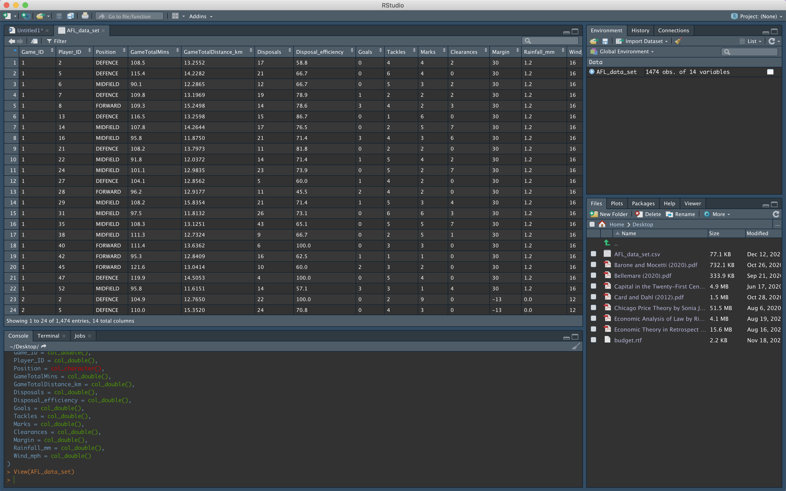
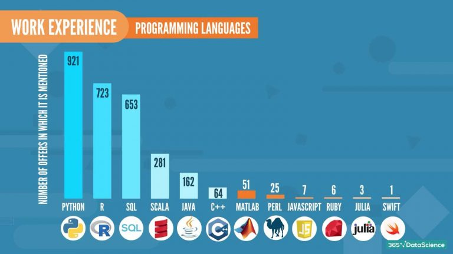

```{r setup, include = FALSE}
library(tidyverse)
library(stargazer)
knitr::opts_chunk$set(echo = TRUE)
```

## Overview

In this tutorial, I will show you how to setup R, perform some basic commands, and explore the data set we discussed in class. The purpose of this tutorial is to get you started with R and to help you understand the properties of the data set. You will also learn some of the most-commonly used functions in R. I don't expect you to be able to write R code from scratch (at this stage), so I will give you help along the way. That said, some of you (many of you?) will have some experience working in R. If that is the case, feel free to skip the more elementary sections of the tutorial.

I wrote and compiled this document in R using Markdown (R can do lots of things beyond just analysing data). Via this document, I will walk you through a number of steps. For each of these steps, I will provide some background and basic instructions, then I will provide the code as well as the output generated by this code. You can copy and paste the code into your own R script. If you have set everything up correctly on your own machine, when you run this code, you should see the same (or similar) output to that which is reported in this document.

I have also attached some images to help explain concepts. If you want to look at these images in detail, just click on them and they should open in a separate window.

###  Install R and RStudio

Before we dive into the data, you need to install R and RStudio. Both are freely available online.  This installation process is straight forward and there is lots of trouble-shooting advice and guidance online if you run into any problems (feel free to email me if you have any issues that you can't solve after a few Google searches). 

To install R, go to https://cloud.r-project.org/ Follow the prompts and be sure to install the latest version.

To install RStudio, go to https://rstudio.com/products/rstudio/download/ Follow the prompts and be sure to install the latest version.


### Open RStudio and explore the environment 

With both programs installed, you should now open RStudio. On first glance, you will have a lot to take in. However, RStudio is less complex than it initially looks. The interface consists of four main panels: the source editor, the console, the environment pane and the browser pane.

For most applications, you will work with RStudio in the following manner. You will write and run your code from a script in the source editor. Output from your code is reported in the console. If you created an object with your code (e.g., data frame/tibble, function, etc), you can interact with this object in the environment pane. For instance, you can open and inspect your data from here. Finally, you can view your files/directory and plots in the browser pane.

The following video provides a useful overview of the RStudio interface (as well as information on how to install R and RStudio - this is helpful if you ran into trouble on the previous step):

https://www.youtube.com/watch?v=dFSPmjSynCs

### Set up your directory, and save data set

With the installation out of the way, you are now ready to start working in R. First, you need to set up your directory. R needs to pull and push files from and to somewhere. This somewhere is your working directory. You can set up your directory in a number of different ways. I am going to have you to do so by running your first piece of R code.

To begin, you need to open an R script by using the menu that drops down from the top-left icon:



In the script you have opened, you now need to enter a command to set the working directory. For simplicitly, you can set your directory to the desktop. If you are working on a Mac, you will need to type something like the following:

```{r, eval=F, echo=T}
setwd("/Users/username/Desktop")
```

If you are working on a Windows computer, you will need to type something like the following:

```{r, eval=F, echo=T}
setwd("C:\Users\username\Desktop")
```

You will need to adapt the code I've provided above to match the naming conventions on your machine (i.e., substitute in your own username, etc). Google how to set your working directory if you run into any issues. On my machine - a Mac - I type and run the following line of code:



As shown in the screenshot above, to run a chunk of code in the editor, simply select the line/s of code you want to run and then click on the `Run` icon in the source editor pane (alternatively, if you are on a Mac, you can highlight the code and hit `Ctrl+Enter`). You will see the same line of code show up in the console pane below the source editor (if it is accompanied by an error message, something has gone wrong and your working directory will not be set to the desktop).

Having set your working directory, you now want to store the raw data file we will be working with on the desktop.

First, you need to download the AFL data set from the course website on the LMS. The data set can also be accessed from the `Preparation` folder on the Github page for this module (click on `AFL_data_set.csv` then click `Raw`; copy and paste the contents to a plain text file and save as `AFL_data_set.csv` on your desktop).

Next, you need to move this file to the desktop on your computer. Once you have done this, the data set should show up as a csv file in the browser pane of your RStudio interface.

You want to see something that looks like the following:



### Install and load packages

As I mentioned in my lecture, you will primarily be working with the 'tidyverse' set of packages. As such, you will need to install and load the tidyverse package. Installing packages in R is straight-forward and follows the same basic convention: specify the name of the package you want to install in the `install.packages()` function.

To install the tidyverse package, you will need to type the following line of code in your script and hit run (just like I showed you above when you set the working directory):

```{r, eval=F, echo=T}
install.packages("tidyverse")
```

Once you have run this line of code, you should see some output show up in the console. This output will identify the package you are downloading and provide you with some additional information. Now that you have installed the tidyverse package, you now need to load this package for use. To do so, you need to run the following line of code:

```{r, eval=F, echo=T}
library(tidyverse)
```

Great. You are now ready to get your hands dirty. One final thing I will mention is that you do not need to install a package every time you want to use it. Once a packaged has been installed, it remains on your local machine (unless you choose to remove it). However, you do need to load installed packages each time you start a new session in R. A good habit to get into is to start each of your scripts with a chunk of code that loads all the packages that you commonly use.

### Load data set

You can now load the AFL data set. To do so, copy and paste the following line of code into your script and run it in from the source editor:

```{r afl, echo=TRUE, message=FALSE}
AFL_data_set <- read_csv("AFL_data_set.csv")
```

Most of the code you will write in R follows this same basic structure: you are using a function - `read_csv()` - to transform an input (our raw data from the csv file) - into an R object - the 'tibble' (i.e., the tidy-version of a data frame), `AFL_data_set`.

If all goes as planned, you should see `AFL_data_set` show up in the environment pane:



If you click on `AFL_data_set`, a spreadsheet-style viewer will display the data in the source editor:



This spreadsheet looks much like what you see when you work with data in Excel. However, unlike with Excel, in R, we do not use point-and-click to interact with the data. Instead, we write pieces of code. This is appealing because code is transparent and fully replicable. 

### Examine the contents and structure of the data set

Alternatively, to get a snapshot of the first ten rows of the data set, as well as a description of its structure and contents, you can simply type the name of the object into your script and hit run:

```{r }

AFL_data_set

```

You should see some output (a crude table) pop up in your console. What can we learn from this output? 

* The top row tells us that the object `AFL_data_set` is a tibble of dimensions 1474x14. That is, our data set contains 1474 rows (or observations) and 14 variables (or measures).
  + As I explained in class, each row is a player-game observation (i.e., a player's performance measures for an individual game).
* The second row down gives us the names of the first six variables in our data set. The notes at the bottom of the table tell us that there are '8 more variables' not reported in the output.
  + This is a limit of viewing a data set in this fashion: if the data set is 'too wide', you only see the first few variables.
* The third row down tells us the 'types' of variables in our data set. You can think of `dbl` as a number, and you can think of `chr` as words.
* From the fourth row down, you can see the actual data (or observations) in our data set.

While this output provides a useful overview of our data set, another helpful way to explore our data is to run the following command, which outputs the first ten rows of the data in a slightly easier-to-read structure:

```{r }

knitr::kable(AFL_data_set[1:10,])

```

To get a better sense of how to interpret the contents of our data set, I will interpret the first row reported above.

* In Game_ID=1, Player_ID=2, a defender, played 108.5 minutes of game time during which he ran 13.3 km. He accumulated a total of 17 disposals, at an efficiency rate of 58.8%. He kicked 0 goals, completed 4 tackles, took 5 marks, and completed 2 clearances. His team lost the game by 30 points. During the game, there was 1.2mm of rainfall, and the average windspeed was 16 miles per hour.

### Creating variables

Now that you have a handle on our data set, I am going to get you to create some new variables. You will use the function `mutate()` to create these variables. I will also get you to use pipes (%>%) to string together pieces of code. You should get in the habit of using pipes. They can help you to compartmentalize blocks of complex code. Pipes also make your code easier to read - something you will appreciate if you ever have to return to and work with a piece of code you wrote in the distant past.

First, I will get you to create a variable that measures running distance in meters per minute of game time. To generate this variable, you need to run the following chunk of code:

```{r }

AFL_data_set <- AFL_data_set %>%
  mutate(Meters_per_min=(GameTotalDistance_km*1000)/GameTotalMins)

```

Second, I will get you to create a variable that indicates (i.e., takes a value of one) if a player kicked 2+ goals in a game and also ran 14+ km. To generate this variable - which we will call `best_on_ground` - you need to run the following chunk of code:

```{r }

AFL_data_set <- AFL_data_set %>%
  mutate(best_on_ground=ifelse(Goals >= 2 & GameTotalDistance_km >= 14, 1, 0))

```

To confirm that your code ran as intended, you should take another quick look at your data set to confirm that the new variables now show up:

```{r }

knitr::kable(AFL_data_set[1:10,])

```

You should seem them as the final two columns in the data set.

### Subsetting our data

When you have large data sets, you will often only want to look at a subset or snapshot of your data. In the case of wide data sets (i.e., many columns), you may want to only look at or work with a subset of variables. In the case of long data sets (i.e., many rows), you may want to only look at or work with a subset of observations.

You can use the function `select()` to 'narrow' a wide data set (i.e., drop variables). For example, let's say we want to create a tibble that contains the following four variables from our AFL data set: `Player_ID`, `Game_ID`, and the two new variables we just created  - `Meters_per_min` and `best_on_ground`. You can run the following code to create this 'narrow' data set:

```{r }

narrow <- AFL_data_set %>%
  select(Player_ID, Game_ID, Meters_per_min, best_on_ground)

```

If we take a quick peek at this new tibble, you can see that it contains only the four variables that we wanted from our original, wider data set:

```{r }

knitr::kable(narrow[1:10,])

```

If you want to 'shorten' a long data set (i.e, drop observations), you can use the `filter()` command. For example, the following piece of code creates a tibble that only contains observations from our AFL data set for which `best_on_ground=1` (i.e., observations where the player scored 2+ goals in the game and ran more than 14 km):

```{r }

short <- AFL_data_set %>%
  filter(best_on_ground==1)

```

You should then be able to see that this new tibble only contains observations from the AFL data set for which `best_on_ground=1`:

```{r }

knitr::kable(short[1:10,])

```


### Summarizing our data 

When working with data, one of the very first things you will want to do is summarize the variables of interest in your data set. This is because it is often not feasible to look at the value a variable takes for every observation in the data set (and even if doing so was feasible, it is not clear what you would learn by just 'eye-balling' the data). Statistics tells us that a good way to summarize a variable is describe its distribution. I will show you two common, easy-to-interpret ways to do this.

You can calculate the summary statistics of a variable. I will get you to use the `summary()` function to do this for the variable GameTotalDistance_km:

```{r }

summary(AFL_data_set$GameTotalDistance_km)

```

A downside of the `summary()` function is that it lacks many of the statistics we commonly use in economics and data science (e.g, standard deviation, etc). An alternative approach is to use the `stargazer()` function from the stargazer package (to use this approach you will need to install and load the stargazer package - to do so, just following the procedure I describe above for installing packages). 

Stargazer produces the following output, which provides a compact overivew of the summary statistics for all the variables in our data set (N.B. Stargazer does not take tibbles as an input, hence why you need to convert the data from a tibble to a data frame within the function):

```{r table, results = "asis"}

stargazer(data.frame(AFL_data_set), type = "html")

```

<br>

You can also summarize a variable by visualizing its distribution. A common way to do so is to produce a density plot (you should have seen these in your statistics or econometrics courses). A density plot is like a smoothed version of a histogram; it tells you how often each value of your variable of interest shows up in your data set. 

If you run the following chunk of code, you will get a density plot for the variable `GameTotalDistance_km`. This plot captures the full distribution, rather than just a subet of the distribution's 'moments' (.e.g, mean, variance, etc.):

```{r }

plot(density(AFL_data_set$GameTotalDistance_km), main='Total Distance Run',
     xlab='Km')

```

This plot is pretty informative (we see that a player runs around 13km in a typical game; some players run a bit more, some players run a lot less), but it also masks a lot of cross-sectional variation. For instance, how does the distribution of running distance vary by playing position? With R, this sort of analysis is fairly trivial to execute - just run a piece of code like the following:

```{r }

plot(density(filter(AFL_data_set, Position == "MIDFIELD")$GameTotalDistance_km), col='red', main='Total Distance Run',
     xlab='Km')
lines(density(filter(AFL_data_set, Position == "FORWARD")$GameTotalDistance_km), col="blue")
lines(density(filter(AFL_data_set, Position == "DEFENCE")$GameTotalDistance_km), col="green")
legend("topright", legend=c("Midfield", "Forward", "Defender"),
       col=c("red", "blue", "green"), lty=1, cex=0.8)

```

### Explore relationships between variables

Most of the time when we work with data, we aren't just interested in looking at variables by themselves. Instead, we most often want to know how variables can be related to each other. How are variables correlated? How can one variable be used to predict another? How does one variable cause another? To answer these sorts of questions, we need to understand how variables are related (we also need to impose a set of assumptions on the underlying data generating process if we want to make causal claims). While we won't cover the later in detail in this module (this is a hugely important topic, but one for another class...), we will teach you how to do the former - i.e., understand whether one variable is associated with another variable.

First, you can use plots and other visuals to understand whether variables are associated with one another. For example, let's look at the relationship between the total number of goals kicked by a team and the final margin of the game. As these variables are by definition mechanically related, we expect a strong positive relationship to show up in our plot. To produce a scatter plot of these variables, you can run the following code (N.B. that before you plot the raw variables, you need to aggreate the player-level data to the team-level, hence the use of the `group_by()` function in the code):

```{r }

grouped <- AFL_data_set %>%
  group_by(Game_ID) %>%
  summarise(total_goals=sum(Goals), margin=mean(Margin))

plot(grouped$total_goals, grouped$margin,
     xlab='Total Goals', ylab='Margin')
```

Although it is not terribly suprising, the plot above shows a strong positive relationship between the total number of goals a team scores and the final margin of the game.

Second, we can quantify the association between two variables by calculating their correlation. R provides a function that allows you to do just this, which we use in the line of code below to look at the association between the total number of goals a team scores and the final margin of the game:

```{r }

cor(grouped$total_goals, grouped$margin)

```

Third, we can also use a regression to quantify the association between two variables. A neat feature of regression is that it also allows us to include additional variables ('controls') in the model. This can be especially powerful if we suspect that a confounding variable is creating (or masking) a relationship between the two variables of interest.

In the follow examples, we will regress margin on total goals by using the `lm()` function. The first model you will run assumes a simple linear relationship between margin and goals; the second model you will run allows for the weather conditions at the ground to affect both the number of goals a team scores and the margin of the game.

```{r }

summary(lm(margin~total_goals, data = grouped))

```

```{r }

grouped_2 <- AFL_data_set %>%
  group_by(Game_ID) %>%
  summarise(total_goals=sum(Goals), margin=mean(Margin), wind=mean(Wind_mph), rainfall=mean(Rainfall_mm))

summary(lm(margin~total_goals+wind+rainfall, data = grouped_2))

```

As we can see in the above output, the coefficient on total_goals is both positive and statistically significant at the 1% level. This is not a great revelation, but it nonetheless makes sense: teams that kick more goals, win games by a greater margin.

As a quick aside, you may be wondering why the coefficient on total_goals is larger than six (i.e., the number of points a team scores when they kick a goal). I'll leave it to you to work out why this might be the case - but I will provide a hint: because game time is finite, when a team scores a goal, this imposes an opportunity cost on the opposition...


### Recap and conclusion

In this tutorial, I have shown you how to setup R, perform some basic commands, and explore the data set we discussed in class. This should put you in good stead to work through the exercise we are going to tackle together next in class workshop. This exercise will deal much more directly with many of the concepts related to performance management that you have discussed in this course. 

Hopefully, this tutorial has also given you taste for the sort of analysis you can perform using R. As I stated earlier in class, R is a great language that you can learn on your own using free online resources. And, one final comment: What I have taught you has real-world applications; in fact, it is excatly the sort of basic 'data science' work that goes on in industry. As such, many employers are very keen to hire graduates for accounting and finance roles that have a solid grasp of R...



